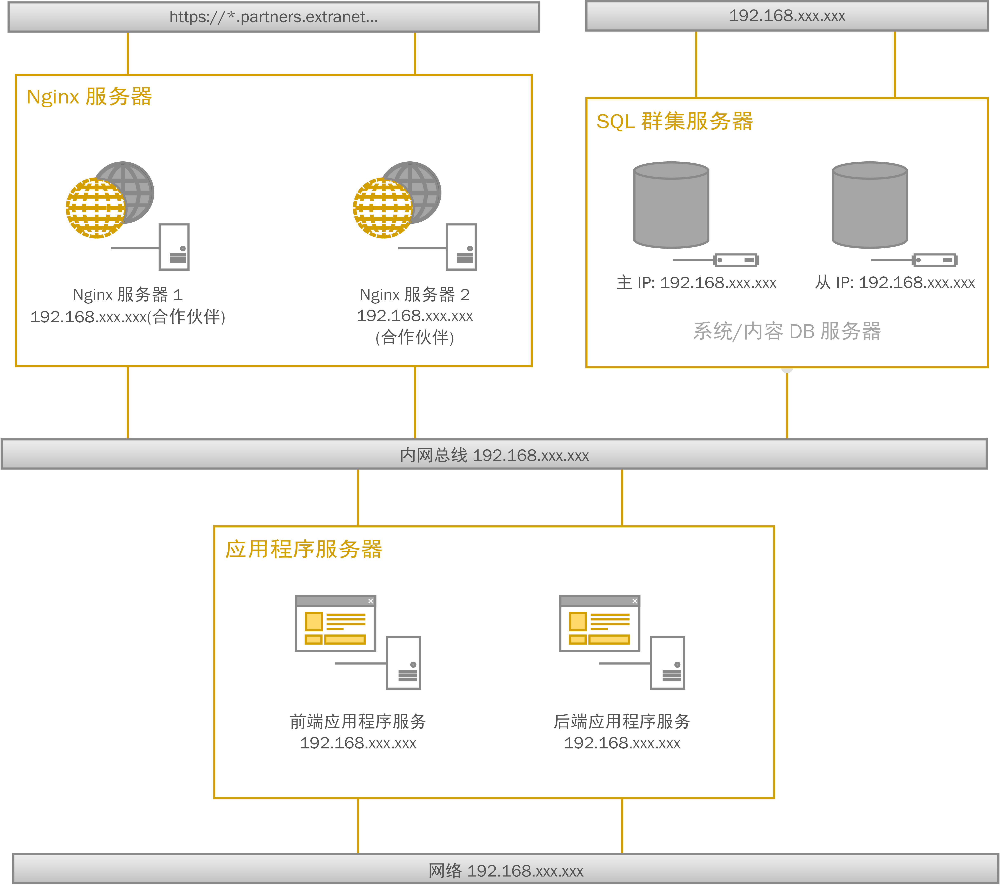

# 总体方案设计

# 1.编写目的
本文件阐述了国煤交易平台系统的软件总体设计、软件运行配置与应用方式以及使用的关键技术等。
# 2.设计依据
依据需求分析中输出的相关文档中阐述的产品功能，进行对应技术方案输出。

参考教学介绍的WEB系统架构方案，结合产品实际情况、功能演进规划，进行技术架构和演进规划。
# 3.术语、定义和缩略语
## 3.1.术语、定义
|名词 | 解释|
|-----|-----|
|SpringBoot|Spring Boot是由Pivotal团队提供的全新框架，其设计目的是用来简化新Spring应用的初始搭建以及开发过程。该框架使用了特定的方式来进行配置，从而使开发人员不再需要定义样板化的配置。|
|MyBatis-Plus|一个 MyBatis 的增强工具，在 MyBatis 的基础上只做增强不做改变，为简化开发、提高效率而生。|
|Vue.js|一套用于构建用户界面的渐进式框架。|
|MySql|一个关系型数据库管理系统。|
|Nginx|一个高性能的HTTP和反向代理web服务器。|
|Docker|一个开源的应用容器引擎。|
## 3.2.缩略语
|缩写|英文全称|中文全称|
|---|-------|------|

# 4.概述
## 4.1.系统目标
**用户体验**：尽量贴近用户习惯，化繁为简。

## 4.2.设计原则
**高效运维**：提高运维效率、减少运维成本

## 4.3.演进规划
暂无

# 5.整体方案
## 5.1.技术架构

### 用户使用层
支持在PC电脑浏览器上使用
### 应用服务层
系统后台基于业内主流WebService框架Springboot进行应用开发。

系统WEB前端使用主流渐进式框架Vue.js.
### 数据存储层
1. 关系型数据存放与：MySql数据库
2. 非关系型数据库存放于：文件

## 5.2.功能架构
## 5.3.运行流程
## 5.4.部署架构
## 5.5.性能设计
# 6.功能详述
## 6.1.
## 6.1.
## 6.1.
## 6.1.
# 7.接口说明
## 7.1.内部接口
## 7.2.外部接口
# 8.开发与运行环境
## 8.1.软件环境
## 8.2.硬件环境
