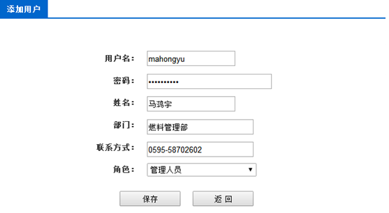
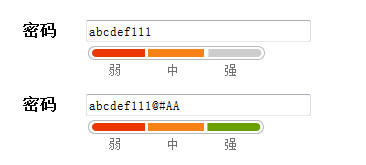

## 6.11用户注册功能详细设计

### 主要页面：

所有填入内容全部为String类型

校验密码长度10-20个字符，密码必须包含字母、数字和常用特殊字符。

用户名不得重复

除密码外，输入框内可输入字符长度不得超过32个（汉字视为一个字符）

### 主要方法描述：

Control层：

1、public ResponseData newUser(@RequestBody User user)新增用户

Service层：

1、public String newUser(User user)创建用户
