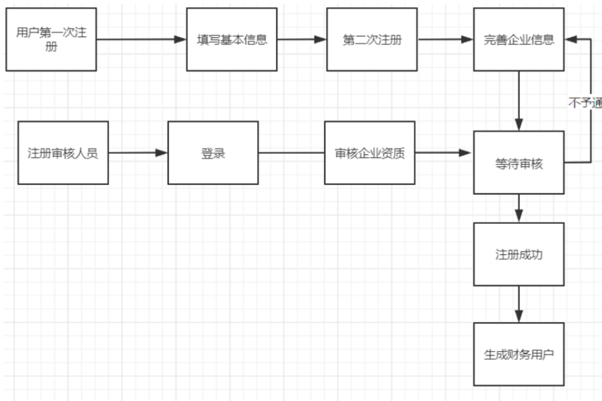
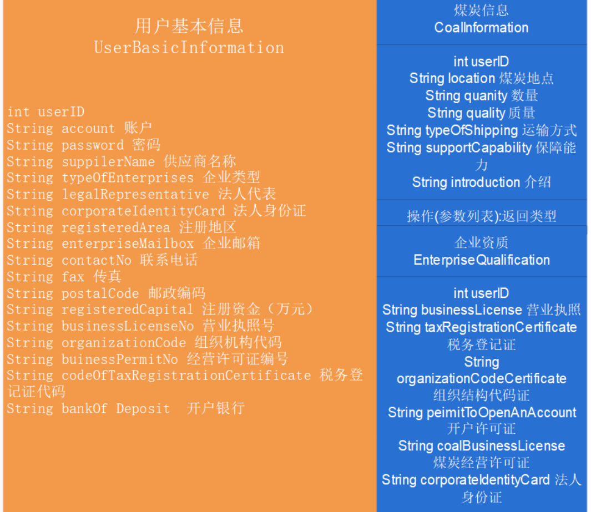

### 6.13用户注册功能点（平台外用户）

##### 流程图

##### 类图：

#### 主要方法描述：

Controller层：

1、public ResponseData register(@RequestBody User user)注册新用户（平台外）

2、public ResponseData login(@RequestBody User user)用户登录

3、public ResponseData complete(@RequestBody CompanyInformation info)用户完善企业信息

4、public ResponseData uploadFile(@RequestPart("file") MultipartFile file, @RequestParam CertType type)企业上传资质文件

5、public ResponseData openFinancialAccount(@RequestBody FinanceProperty finance)生成企业财务账户表和财务用户功能

6、public ResponseData getUserInfo()获取登录用户的个人信息

7、public ResponseData getUserFullInfo()获取企业所有注册信息

Service层：

1、public boolean isUserExist(String login, String email)检测用户是否已经存在

2、public String register(User user)注册新用户

3、ResponseData complete(CompanyInformation companyInformation)完善企业信息

4、List<Role> getRoleList(String type)获取指定角色类型的角色列表

5、ResponseData finance(FinanceProperty financeProperty)生成企业财务账务表

6、Map<String,String> financeAccount()生成财务用户

7、ResponseData getInfo(long id)获取登录用户的基本信息

8、User getFullInfo(long id)获取企业所有注册信息

##### 开发日志及节点：

此模块为优先级最高的开发模块，应最先进行
