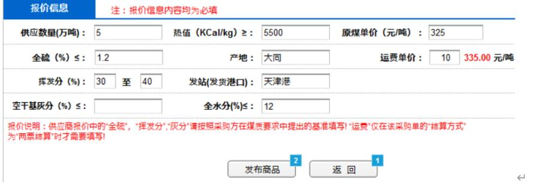

## 6.2卖方挂牌功能详细功能设计

主要流程图：

编辑商品页面：

数据存入需求表

所有输入参数及时校验（前端JS实现）。数值型参数输入框中， 可输入整型、实型数字，但不允许输入其他字符；文本型输入框可输入汉字、字母、数字及其组合，不允许输入其他符号或字符；

 文本型输入框中可输入字符长度不超过32个（汉字视为1个字符）；

 界面中所有参数均为必填参数；

主要方法描述：

Controller层：

1、public ResponseData getList(@RequestParam(defaultValue = "", required = false) Long userId, @RequestParam(defaultValue = "1", required = false) int page, @RequestParam(defaultValue = "10", required = false) int limit)：获取公共可用的挂牌需求列表

2、public ResponseData getPublicDetail(@RequestParam int id)：获取某一个可用的公共挂牌需求详细信息

3、public ResponseData myList(@RequestParam(defaultValue = "1", required = false) int page, @RequestParam(defaultValue = "10", required = false) int limit)：获取用户所有挂牌需求

4、public ResponseData myDetail(@PathVariable long id)：获取用户自己的挂牌需求详细信息

5、public ResponseData publish(@RequestBody Request req)：发布新挂牌需求或保存新挂牌需求草稿

6、public ResponseData edit(@RequestBody Request req)：编辑用户自己的挂牌信息

7、public ResponseData auditPending(@RequestParam(defaultValue = "1", required = false) int page, @RequestParam(defaultValue = "10", required = false) int limit)：审核员：获取待审核的挂牌列表

8、public ResponseData auditDetail(@PathVariable long request_id)：获取待审核挂牌信息列表中的某一详细挂牌信息

9、public ResponseData auditDo(@RequestBody Map<String, Object> request, @PathVariable long req_id)：审核员：对挂牌信息进行审核操作

10、public ResponseData contractUpload(@RequestParam MultipartFile contract, @PathVariable("req_id") long requestId)：交易用户进行交易合同的上传

11、public ResponseData contractFile(HttpServletResponse response, @PathVariable("req_id") long requestId, @RequestParam String path)：获取上传的交易合同

12、public ResponseData getComName()：获取公司名称

Service层：

1、Map<String,Object> getPublicList(Long userId, int page, int limit)：获取需求列表

2、Request getPublicDetail(int id)：获取详细需求

3、long newReq(Request request)：新建需求

4、int edit(Request request)：编辑需求

5、Map<String,Object> myList(Long userId, int page, int limit)：用户的需求

6、Request myDetail(Long userId, long req_id)：用户的需求详情

7、Map<String, Object> auditPending(int page, int limit)：待审核需求列表

8、Request auditDetail(long req_id)：未审核需求的详情

9、boolean doAudit(Request request)：审核需求

10、boolean updateContract(long reqId, long userId, String contractPath)：更新合同文件路径

11、String getComName(long id)：获取公司名称

注：保证金相关参考6.6、6.7详细功能设计，登录相关参考6.13详细功能设计