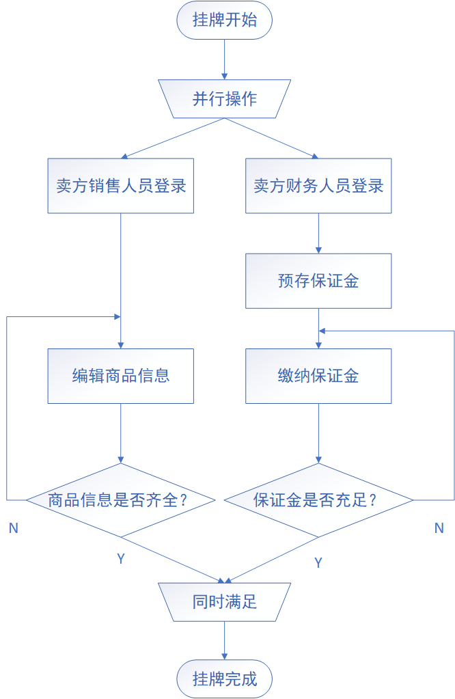

## 6.2详细功能设计

主要流程图：

编辑商品页面：

数据存入表ct_coal。（原SellerDelisting表）

所有输入参数及时校验（前端JS实现）。数值型参数输入框中， 可输入整型、实型数字，但不允许输入其他字符；文本型输入框可输入汉字、字母、数字及其组合，不允许输入其他符号或字符；

 文本型输入框中可输入字符长度不超过32个（汉字视为1个字符）；

 界面中所有参数均为必填参数；

主要方法描述：

Controller层：

1、doGet：获取前端请求、登录模块传入的状态信息（登录模块将用户信息传入本模块）以及保证金模块传入的状态信息，调用同层doPost方法

2、doPost：调用业务层MessageSave方法，将请求信息传递给xx方法

Service层：

1、MessageSave：调用数据访问层MessageSet方法将前端传入的数据存入数据库

ORM-Mapper层：

1、MessageSet：将数据写入ct_request表中

注：保证金相关参考6.7详细功能设计，登录相关参考6.13详细功能设计