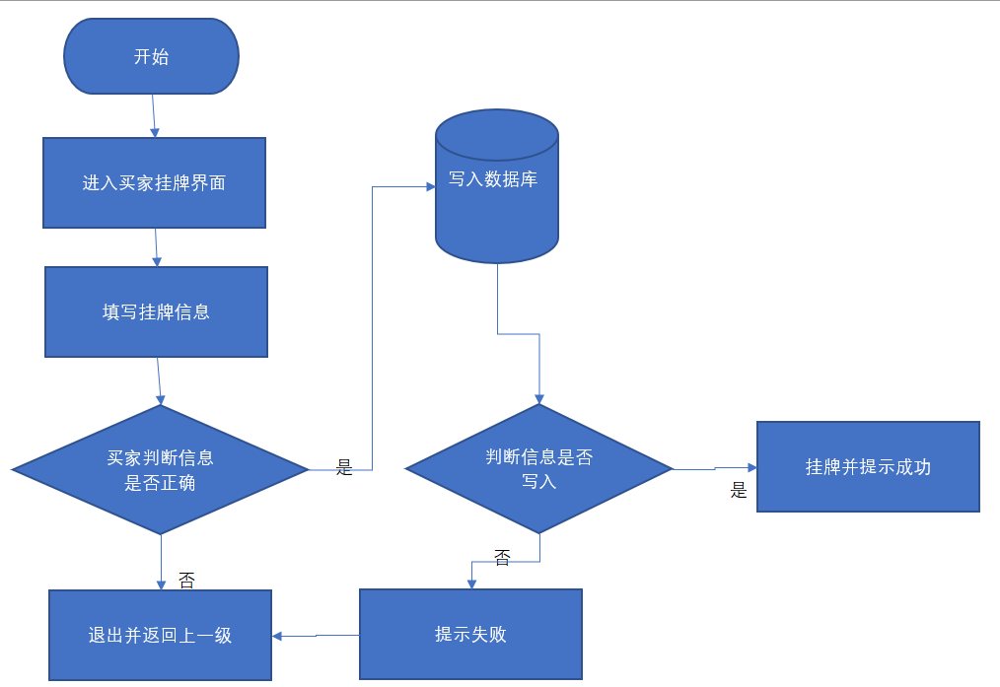
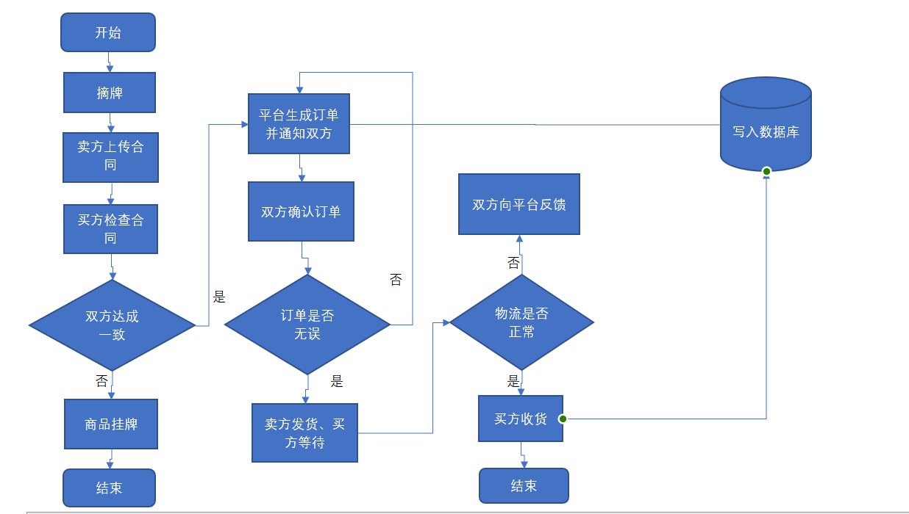
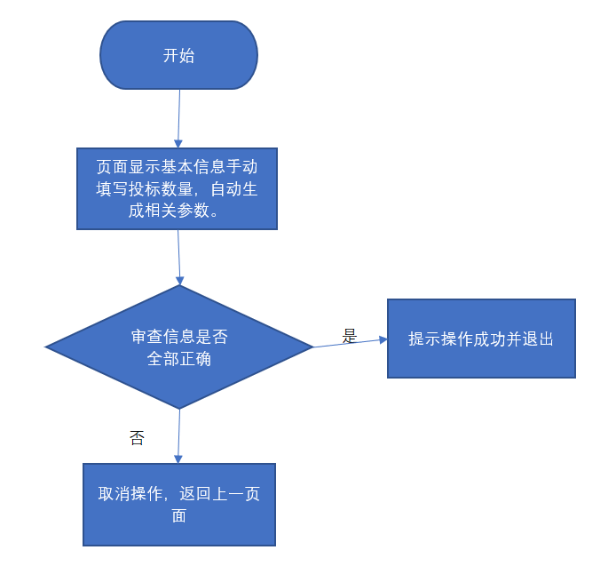

 ### 6.3买方挂牌功能点

#### 功能流程图：

#### 类图：

#### 变量定义：

与卖方挂牌保持一致。

coal_Poo(place of origin)：煤炭原产地 coal_weight：（这批）煤炭质量（吨） coal_supplier：煤炭供应商 coal_type：煤炭类型 coal_ID：（这批）煤炭编号 coal_BLCV(base low calories value)：煤炭基低位发热量 coal_Mt：煤炭全水份（%） coal_Aar：基灰分（%） coal_St_ar：基全硫（%） coal_Var：基挥发分（%，该成员变量是一个区间） coal_Mad：空干基水分（%） coal_St_ad：空干基全硫（%） coal_Vad：空干基挥发分（%） coal_DBHCV(dry base height calories value)：干基高位发热量 coal_St_d：干基全硫（%） coal_DAFVM(dry ash-free volatile matter)：干燥无灰基挥发分 coal_graininess：颗粒度（mm） coal_ST：灰熔点（℃） coal_HG：哈式可磨系数

####主要方法描述：

与6.2卖方挂牌一致

#### 开发日志及节点：

买卖双方及平台方相关数据库建立完成后即可着手开发。前后端可同时可开发。

### 6.4买方摘牌功能点

#### 功能流程图：

#### 主要方法描述：

与卖方摘牌一致

##### Filter：

LoginFilter：用于检测点击“摘牌”按钮的用户是否登录

#### 开发日志及节点：

买卖双方及平台方相关数据库建立完成后即可着手开发。前后端可同时可开发。

### 6.7保证金支付功能点

#### 功能流程图：

#### 主要方法描述

control层：

1、public ResponseData showInformation()：展示用户财务信息

2、public ResponseData SecurityPayment(@RequestBody double number, @PathVariable String requestId)：输入需求量，计算出保证金并缴纳

service层：

1、public FinanceProperty getFinanceById(Long userId)：获取用户财产信息

2、public Boolean setDeposit(Long userId,String requestId,double number)：缴纳保证金

#### 开发日志及节点：

买卖双方及平台方相关数据库建立完成后即可着手开发。前后端可同时可开发。

