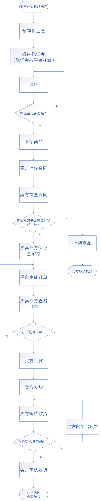
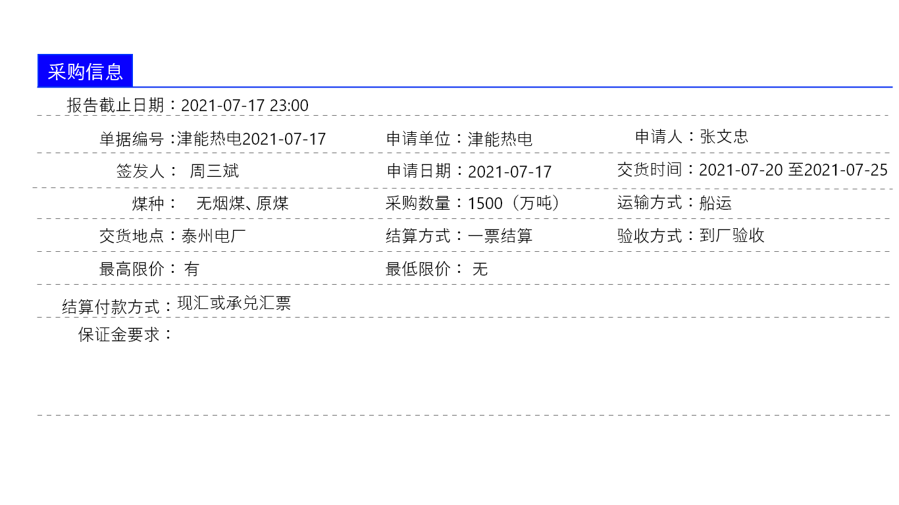
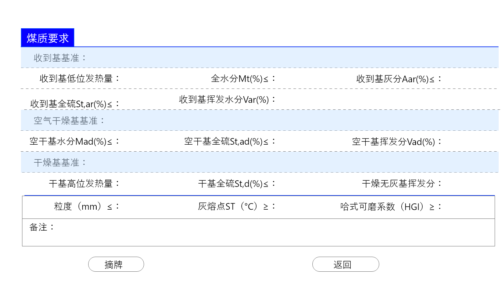
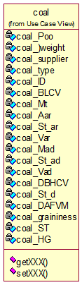

## 6.5卖方摘牌详细设计

主要流程图：

#### 相关页面内容：

该页面包含两张表单和两个按钮，如图所示

注：该页面所有数据均为只读，不可修改

采购信息数据来源coal_buy表，煤质信息数据来源coal_quality表

#### 相应类图：

煤炭类图参考：

变量定义：

coal_Poo(place of origin)：煤炭原产地		coal_weight：（这批）煤炭质量（吨）		coal_supplier：煤炭供应商		coal_type：煤炭类型		coal_ID：（这批）煤炭编号		coal_BLCV(base low calories value)：煤炭基低位发热量		coal_Mt：煤炭全水份（%）		coal_Aar：基灰分（%）		coal_St_ar：基全硫（%）		coal_Var：基挥发分（%，该成员变量是一个区间）		coal_Mad：空干基水分（%）		coal_St_ad：空干基全硫（%）		coal_Vad：空干基挥发分（%）		coal_DBHCV(dry base height calories value)：干基高位发热量		coal_St_d：干基全硫（%）		coal_DAFVM(dry ash-free volatile matter)：干燥无灰基挥发分		coal_graininess：颗粒度（mm）		coal_ST：灰熔点（℃）		coal_HG：哈式可磨系数

#### 主要方法描述：

##### Controller层：

1、doGet：获取前端请求，调用同层doPost方法

2、doPost：调用业务层Logincheck方法，将请求信息传递进去

##### Service层：

1、ValidCheck：调用数据交换层GetUser方法获取用户信息，对摘牌用户保证金进行审核。若通过，则从前端页面撤下相关挂牌信息并调用ContractCheck方法进行买卖双方确认合同操作；若未通过则产生相应提醒。

2、ContractCheck：调用数据交换层GetContract方法获取挂牌方上传的合同，并发送给摘牌方审查。该页面除了合同正文外还有三个按钮“同意”、“不同意”和“修改”。合同正文为可编辑模式。一旦对合同进行了任何修改，“同意”按钮无法点击，并且修改部分为高亮显示。点击“修改”后将会把修改后的合同再次发送给另一方审查并修改。直到双方不再进行修改并点击“同意”按钮。点击“同意”按钮后将解冻买卖双方保证金，接着调用业务层OrderCheck方法进行订单相关操作。点击“不同意”则直接取消摘牌操作并在前端页面上架挂牌信息。

3、OrderCheck：调用数据访问层GetOrder方法获取买卖双方填写的信息生成订单页面并通知双方进行确认。若有误则重新调用GetOrder方法生成订单页面，或者让买卖双方联系客服。若无误则通知卖方发货。

##### ORM-Mapper层：

1、GetUser：查询ct_users表，获取用户未冻结金额等信息并返回该信息

2、GetContract：查询ct_contract表，获取对应挂牌方ID和挂牌ID两个主键对应的合同信息并返回

3、GetOrder：查询ct_request表和ct_users表，获取挂牌方信息和摘牌方地址信息并返回

##### Filter：

LoginFilter：用于检测点击“摘牌”按钮的用户是否登录