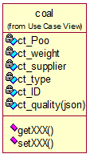

## 6.5卖方摘牌详细设计

主要流程图：

#### 相关页面内容：

该页面包含两张表单和两个按钮，如图所示

注：该页面所有数据均为只读，不可修改

采购信息数据、煤质信息数据来源ct_request表

#### 相应类图：

煤炭类图参考：

变量定义：

ct_Poo(place of origin)：煤炭原产地		ct_weight：（这批）煤炭质量（吨）		ct_supplier：煤炭供应商		ct_type：煤炭类型		ct_ID：（这批）煤炭编号

以下为ct_quality(json)内容：

ct_BLCV(base low calories value)：煤炭基低位发热量		ct_Mt：煤炭全水份（%）		ct_Aar：基灰分（%）		ct_St_ar：基全硫（%）		ct_Var：基挥发分（%，该成员变量是一个区间）		ct_Mad：空干基水分（%）		ct_St_ad：空干基全硫（%）		ct_Vad：空干基挥发分（%）		ct_DBHCV(dry base height calories value)：干基高位发热量		ct_St_d：干基全硫（%）		ct_DAFVM(dry ash-free volatile matter)：干燥无灰基挥发分		ct_graininess：颗粒度（mm）		ct_ST：灰熔点（℃）		ct_HG：哈式可磨系数

#### 主要方法描述：

##### Controller层：

1、public ResponseData delistRequest(@RequestParam long request_id)：摘牌功能

2、public ResponseData getDelistList( @RequestParam(defaultValue = "1", required = false) int page, @RequestParam(defaultValue = "10", required = false) int limit)：交易审核员获取所有摘牌列表

3、public ResponseData getDetailInfo(@RequestParam long delistId)：交易审核员获取指定的摘牌详细信息及摘牌信息

4、public ResponseData getDetailInfoForUser(@RequestParam long delistId)：公司账户获取指定的摘牌详细信息及对应的挂牌信息

5、public ResponseData getDetailInfoForUser2(@RequestParam long reqId)：公司账户获取指定的挂牌信息及对应的摘牌详细信息

6、public ResponseData examineTransaction(@RequestParam int zpId, @RequestBody AuditOpinion opinion)：交易审核操作

7、public ResponseData getDelistListFinance( @RequestParam(defaultValue = "1", required = false) int page, @RequestParam(defaultValue = "10", required = false) int limit)：获取财务用户的公司所有摘牌信息

##### Service层：

1、ResponseData delist(Delisting delisting)：摘牌功能

2、Map<String,Object> listDelist(int page, int limit)：获取摘牌列表

3、ResponseData getDetailInfoByZPId(long delistId)：根据摘牌ID获取挂牌摘牌的详细信息

4、ResponseData getDetailInfo2(long gpId, long userId)：根据用户ID和挂牌ID 获取挂牌摘牌的详细信息

5、ResponseData examine(long delistId, AuditOpinion opinion)：审核功能

6、Map<String,Object> listDelistFinance(TokenProfile profile, int page, int limit)：获取摘牌列表

7、ResponseData getDetailInfoForUser(TokenProfile profile,long delistId)：公司账户获取指定的摘牌详细信息

8、ResponseData getDetailInfoForUser2(TokenProfile profile, long reqId)
