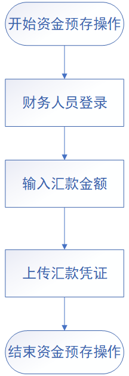

## 6.6资金预存详细设计

### 主要流程图：

### 主要页面描述：

#### 信息来源：

保证金账户信息四项：从表ct_fund获取，不允许用户编辑

汇款单位、开户行名称、银行账号、汇款时间从表ct_fund获取，不允许用户编辑

汇款金额：填写实际汇款金额，值为无符号整型，单位：元，必填

汇款凭证：上传汇款凭证图片，大小不得超过1M，必填（可能会出现相同金额的情况）

### 主要方法描述：

#### controller层：

1、public ResponseData basicInfo()：获取企业信息

2、public ResponseData setQuantity(@PathVariable Double quantity)：设置提交数量

3、public ResponseData upLoad(@PathVariable Double quantity, @PathVariable String path)：提交文件

#### service层：

1、CashSet：调用数据访问层的CashSave方法，将前端传入的汇款金额传入该方法。汇款凭证存入服务器，将文件路径存入数据库

2、SecurityDepositGet：调用数据访问层SecurityDepositRead方法，将发送请求的用户信息作为参数传入，获取相应账户保证金信息并返回

3、ReceivingUnitGet：调用数据访问层ReceivingUnitRead方法，将发送请求的用户信息作为参数传入，获取对应收款方信息并返回

#### ORM-Mapper层：

1、CashSave：将汇款金额和汇款凭证写入ct_fund表

2、SecurityDepositRead：查询ct_fund表，读取预存账户金额、未冻结金额、报价冻结金额以及预约冻结金额四项数据并返回

3、ReceivingUnitRead：查询ct_fund表，读取汇款单位名称、开户行名称、银行名称、汇款时间以及汇款凭证五项数据并返回