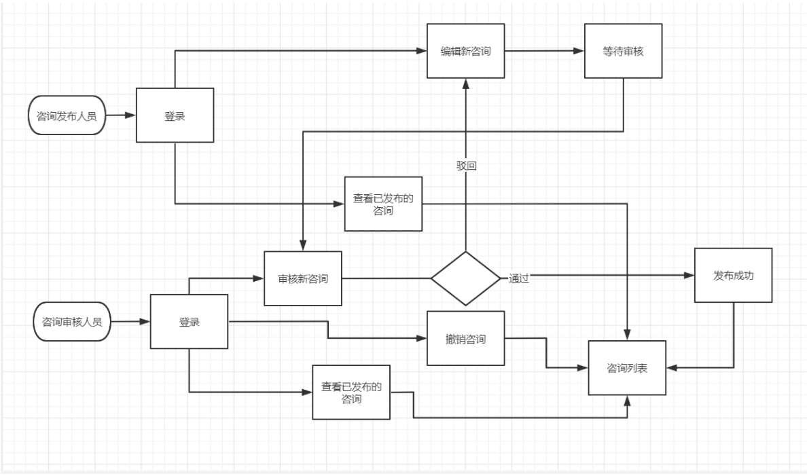
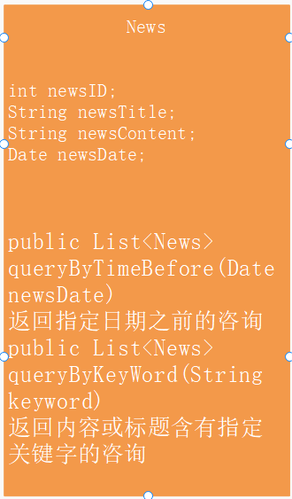
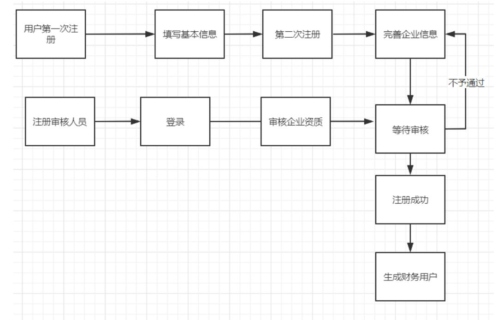
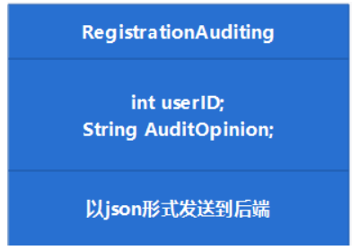
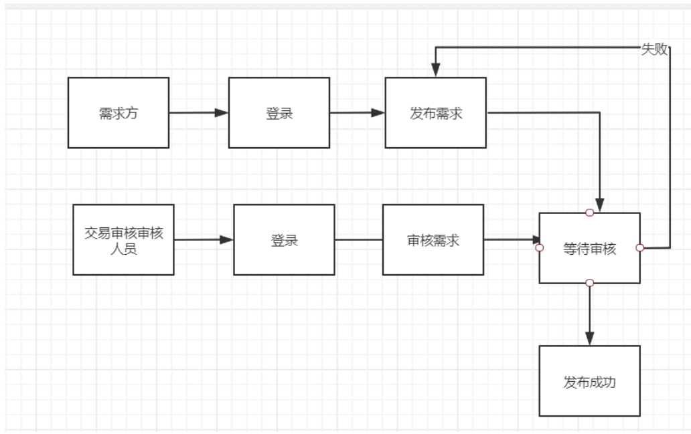
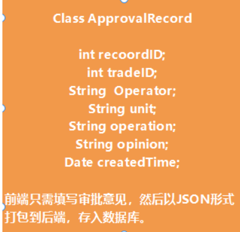

### 6.8咨询发布功能点

#### 功能流程图：

#### 类图：

#### 开发日志及节点：

该模块应于6.13用户注册功能模块，6.9注册账户审核功能模块及6.11用户创建功能模块（平台内用户，可暂时测试用）完成之后开始开发，前后端同步开发。同时记录开发日志（暂定）

### 6.9注册账户审核功能点

##### 流程图：

##### 类图：

##### 开发日志和节点：

该功能应于6.13用户注册功能模块完成后进行

### 6.10交易审核功能点

#### 流程图：

##### 类图：

##### 开发日志及节点：

该模块应于6.13用户注册功能模块，6.9注册账户审核功能模块，6.2或6.3任一挂牌功能完成，才能进行

