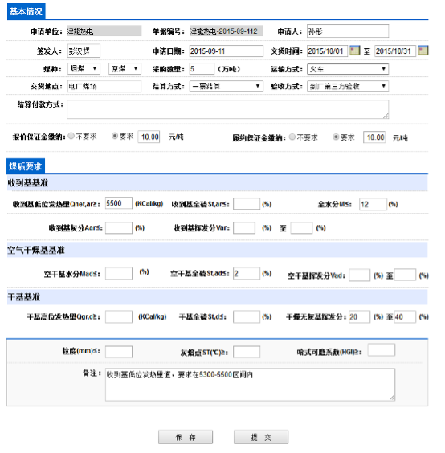
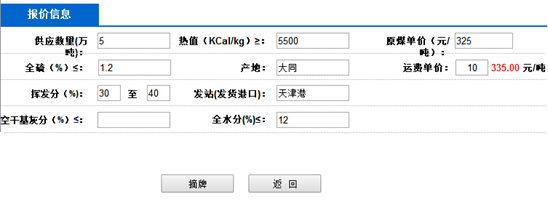

# 6-3&&6-4

## **买方挂牌功能**

- “申请单位”框自动填写登录用户所属公司名称，且不允许用户修改
- “申请日期”框自动获取当前日期，且不允许用户修改
- 煤种信息中，煤炭分类可选值为：烟煤、无烟煤、褐煤、贫瘦煤、其他；商业分类可选值为：原煤、混煤、中煤、煤泥、其他
- 运输方式可选值为：火车、汽车、船运、其他
- 结算方式可选值为：一票结算、二票结算、铁路大票、煤款税票、其他
- 验收方式可选值为：到厂验收、到厂第三方验收、港口第三方验收
- 报价保证金缴纳：若为“不要求”，则后续价格框为不可编辑
- 履约保证金缴纳：要求同上，但在当前版本中不使用
- 煤质要求：收到基低位发热量、收到基全硫、全水分、空干基全硫、干燥无灰基挥发分均为必填项，其他各项可选

## **买方摘牌功能需求说明**

- 买方摘牌界面所有数据均不可编辑
- 数据完全又卖方提供

### 注意

- 后期可根据项目实际情况更改参数设置

