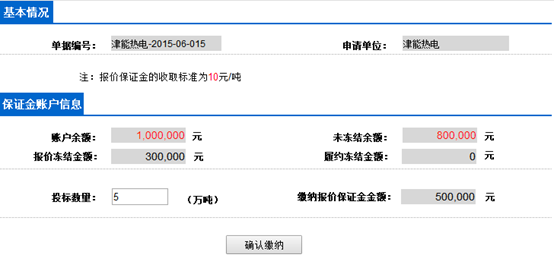

### **6.7资金支付功能需求说明功能点：**

##### 该板块分为两部分：基本信息和保证金账户信息

基本信息包括：单据编号、申请单位；			保证金账户信息包括：账户余额、未冻结金额、报价冻结金额、履约冻结金额、缴纳保证金金额、投标数量。

所有信息中，除了投标数量为可由用户自行填入之外，其余信息均添加灰色背景，表示不可修改。字体颜色为黑色

板块最下方包括一个按钮：“确认缴纳”（原图中还包括一个“返回”按钮，经过考虑后决定删除该按钮）

##### 信息获取方式：

申请单位自动读取正在登陆的用户填入的单位名称

单据编号由单位名称加上系统日期组合而来，格式为“xxxx-2021-07-17”

账户余额、未冻结金额、报价冻结金额、履约冻结金额通过系统自动读取表SecurityDeposit获取。可以将买家信息表中的单位编号之类的字段设置为外键，充当SecurityDeposit表里的主键

缴纳报价保证金金额由**投标数量**和挂牌信息中的**保证金费率**相乘得来。经过**及时校验**后，若该金额少于未冻结金额，字体颜色变为红色，且在该信息后面用红色文字提醒金额不足。“确认缴纳”按钮变为灰色不可点击状态

投标数量允许填入的字符长度不允许超过8个字符（仅限填入数字，超过8个字符则显示“无效数据”）

点击“确认缴纳”并成功后弹出提示框，提示缴纳成功