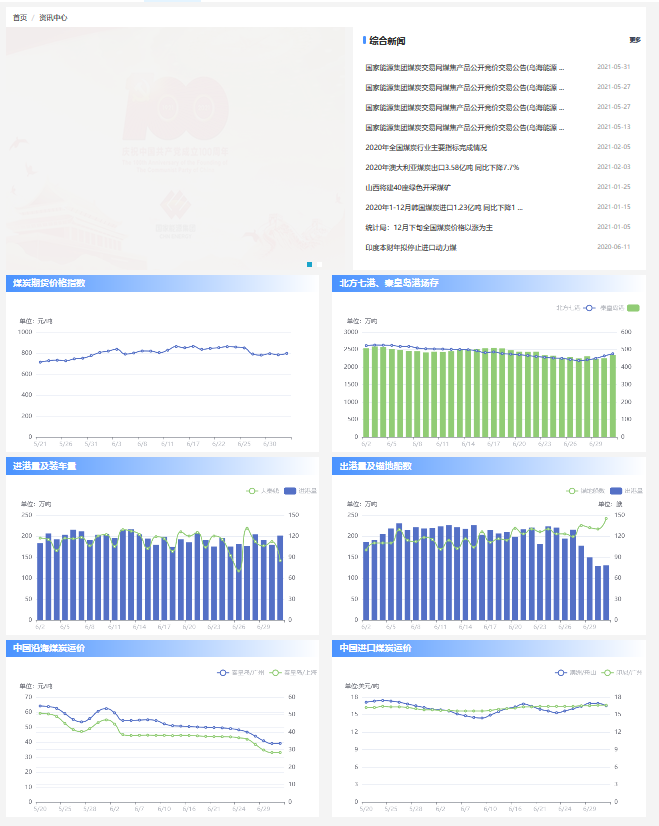

### 6.8资讯发布功能需求功能点

该模块共有两部分组成，两部分在同一个页面

#### 第一部分是由一个轮播图、资讯标题列表和一个”更多“按钮组成。如图：

资讯标题列表由若干资讯详细信息页面的链接组成，点击相应标题可打开一个新页面用于浏览详细资讯

咨询内容由**资讯编辑人员**编写，由**资讯审核人员**审核通过后发布到该页面。资讯有效期结束后由**审核人员**进行撤下操作

“更多”按钮用于跳转到一个根据资讯发布单位或资讯标题来详细搜索的页面

#### 第二部分由6幅统计图组成，如图：

6张统计图标题定义如下：

中国煤炭期货价格指数：中国煤炭价格指数用于描述全国以及各区域、各品种煤炭市场价格变化的走势和平均变化幅度。

北方七港、秦皇岛港场存：指的是这两处港口现存的煤炭数量，单位万吨。绿色柱状图为秦皇岛港煤炭存量，蓝色折线图表示北方七港煤炭存量

进港量及装车量：进港量指从发货地进入到达收货地暂存仓库的煤碳量；装车量：指的是从原产地装入列车的总煤碳量

出港量：指的是煤炭从发货地暂存仓库中登记出库发往目的数量；锚地船数：字面意思

中国沿海煤炭运价：字面意思

中国进口煤炭运价：字面意思

数据获取渠道：由资讯编辑人员手动输入数据、审核人员审核通过后生成统计图

统计图仅限展示数据，点击后没有任何反应

注：原页面的统计图为动态可互动形式，鼠标光标悬浮于统计图某结点所在的条状区域时会实时显示该结点的数据。为减轻工作量，该功能可以考虑不必实现

