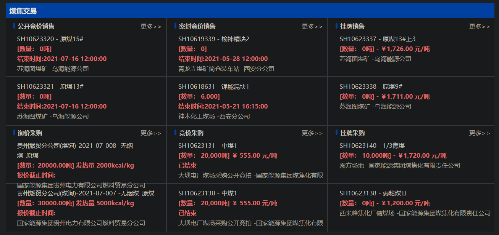
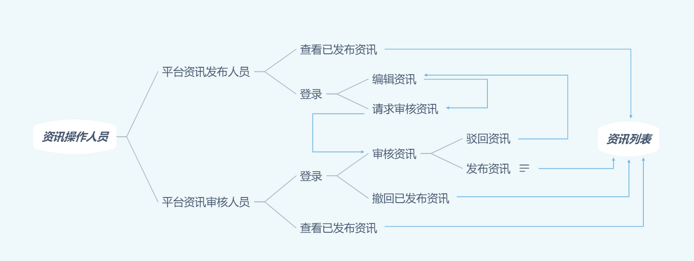

### 6.8资讯发布功能点

该模块包含若干文字型资讯，内容为买卖方挂牌的**简要信息**，包括竞价编号、煤炭类型、煤炭数量、挂牌结束时间（可选）、供货方（需求方）。点击相应区域即可进入挂牌详细信息页面。

资讯由平台资讯发布人员根据买卖方的挂牌信息编写，由平台咨询审核人员审核通过后发布到该页面。该板块共可以放置4x3（行x列）共12个资讯块（具体页面设计可根据实际情况进行改变），除此之外该可以在该页面基础上增加“页码”按钮，用于浏览下一页上一页和快速跳转页面的操作

资讯在交易结束后仍会存在一段时间，待到资讯有效期到了之后由平台资讯审核人员进行撤下操作。有效期可以统一定为一个时间，比如规定有效期为交易结束后一个星期。

